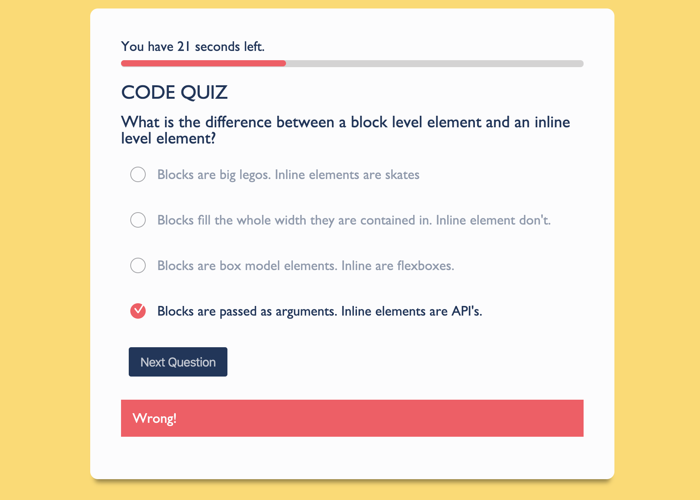

# Code Quiz / [Demo](https://yarocruz.github.io/code-quiz/) 



## Description

This is a quiz app, specifically a code quiz app that tests your knowdlege on web development. It is a timed test and it will take seconds down from the timer if you get a wrong answer. 

To start the quiz you click on the start quiz button. It immediately presents the user with the first set of questions and starts the timer with a progress bar. When the user selects a question, it checks if it's a right or wrong answer. When a correct answer is selected it adds it to a score variable, which later gets added to local storage. When the time is up or if the user selects the last question, a confirm box fires up to collect the user's name. 

The users and scores keep getting added and retrieved from local storage, and are displayed on a separate page.

## Technologies

This project uses plain ol' JavaScript. There is a ton of DOM manipulation on this one. It uses the **setInterval** function for the timer and **localStorage** to capture user scores. Many for loops where needed and many if statements as well. 

## Problems / Solutions

Every part of this project has been challenging. Working with the **setInterval** function can be tricky, specially for when you need to stop it according to certain conditions. Another part that was challenging was the its scope. Compared to the [password-generator](https://github.com/yarocruz/password-generator/blob/master/develop/script.js) this one is literally double the size. The main JS file ended at about 200 lines of code. Everytime I started to lose track of which line started what, I created a function that was as descriptive as possible to what I was trying to do. The most challenging part and interesting line of code I wrote for this project was hands down the disableCheckbox function:

``` js
function disableCheckboxes() {
    for (let checkbox of checkBoxes) {
        checkbox.addEventListener('click', (e) => {
            if (e.target.checked) {
                for (let unchecked of checkBoxes) {
                    if (!unchecked.checked) {
                        unchecked.disabled = true;
                        unchecked.nextSibling.style.opacity = '0.5';
                    }
                    checkbox.disabled = true;
                }
            }
        })
    }
}
```

## Demo

See live demo [here](https://yarocruz.github.io/code-quiz/)

## License 

[MIT](/LICENSE)

Feel free to clone this repo and modify as you wish.